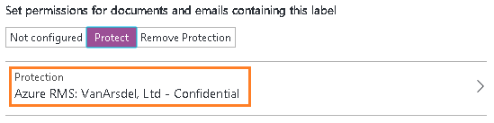

# Passaggio 2: Configurare e pubblicare criteri di Azure Information Protection

>*Si applica a: Azure Information Protection*

Il criterio predefinito disponibile con Azure è utilizzabile senza alcuna operazione di configurazione. Tuttavia si esaminerà questo criterio e vi si apporterà qualche modifica.

1. In una nuova finestra del browser accedere al [portale di Azure](https://portal.azure.com) come amministratore globale o della sicurezza per il tenant.

2. Nel menu hub fare clic su **Nuovo** e quindi, nell'elenco **Marketplace**, selezionare **Sicurezza e identità**. Nel pannello**Sicurezza e identità**, nell'elenco **App in primo piano**, selezionare **Azure Information Protection**. Nel pannello **Azure Information Protection** fare clic su **Crea**.

    Questa operazione attiva il servizio per il tenant e crea il pannello **Azure Information Protection** in modo che al successivo accesso al portale sarà possibile selezionare il servizio dall'elenco **More services** (Altri servizi) dell'hub. 

    > [!TIP] 
    > Selezionare **Aggiungi al dashboard** per creare un riquadro **Azure Information Protection** nel dashboard, in modo da ignorare la ricerca del servizio al successivo accesso al portale.

3. Leggere le informazioni disponibili nella pagina **Avvio rapido** che si apre automaticamente quando ci si connette al servizio per la prima volta. È possibile tornare a questa pagina in un secondo momento. Per questa esercitazione, fare clic su **Criteri globali** per aprire il pannello **Criteri: globali**. Questo pannello, che si apre automaticamente per connessioni successive al servizio, visualizza i criteri predefiniti di Information Protection creati automaticamente per il tenant:
    
    - Etichette per la classificazione: **Personal**, **Public**, **General**, **Confidential** (Riservato) e **Highly Confidential** (Riservatezza elevata). Le ultime due etichette possono essere estese per visualizzare le etichette secondarie, che includono **All Employees** (Tutti i dipendenti) e **Anyone (not protected)** (Chiunque - senza protezione) che offrono esempi su come una classificazione può avere sottocategorie.
    
       > [!NOTE]
       > I criteri predefiniti potrebbero essere leggermente diversi da quelli illustrati in questa esercitazione. Ad esempio, si ha un'etichetta denominata **Internal** anziché **General**, e **Secret** anziché **Highly Confidential** (Riservatezza elevata). In alternativa, si dispone di un'etichetta secondaria aggiuntiva denominata **Recipients Only** (solo destinatari). Questo perché sono disponibili diverse versioni del criterio predefinito, a seconda di quando è stato creato per il tenant. Oppure è possibile che tali modifiche siano state apportate manualmente prima di iniziare l'esercitazione.
       > 
       > Se i criteri predefiniti hanno un aspetto diverso, è comunque possibile eseguire l'esercitazione, ma è necessario tenere presente queste modifiche quando si leggono le istruzioni e si fa riferimento alle immagini incluse di seguito. Se si vogliono modificare i criteri predefiniti in modo che corrispondano ai criteri predefiniti correnti, vedere [Criteri predefiniti di Azure Information Protection](../deploy-use/configure-policy-default.md).

    - Con la configurazione predefinita, alcune etichette non hanno contrassegni visivi configurati, ad esempio piè di pagina, intestazione, filigrana. A seconda dei criteri predefiniti, alcune etichette potrebbero avere impostata la protezione oppure no. Ecco un esempio.
    
    
    
    Anche alcune impostazioni dei criteri non sono definite. Non tutti i documenti e i messaggi di posta elettronica devono avere un'etichetta, non è presente un'etichetta predefinita e gli utenti non devono dare una giustificazione quando modificano le etichette:
    
    

## Modifica delle impostazioni per un'etichetta predefinita e per la richiesta di giustificazione

Nel corso di questa esercitazione verranno modificate alcune impostazioni dei criteri per poterne osservare il funzionamento:

1. Impostare **Select the default label** (Selezionare l'etichetta predefinita) su **General**. 

    Se non si ha questa etichetta perché si sta usando una versione precedente dei criteri, scegliere **Internal** come etichetta equivalente.

2. Impostare **Gli utenti devono fornire una giustificazione per la configurazione di un'etichetta di classificazione più bassa, la rimozione di un'etichetta o la rimozione della protezione** su **On**.

## Configurazione di un'etichetta per la protezione, di una filigrana e di una condizione per la richiesta di classificazione

Verranno modificate ora le impostazioni di una delle etichette secondarie, ovvero **All Employees** (Tutti i dipendenti) dall'etichetta principale **Confidential** (Riservato). 

Se l'etichetta **Confidential** (Riservato) non ha etichette secondarie perché si sta usando una versione precedente dei criteri, è possibile usare l'etichetta **Confidential** (Riservato) come alternativa. I passaggi di configurazione sono gli stessi, ma il nome del pannello dell'etichetta è **Confidential** (Riservato) anziché **All Employees** (Tutti i dipendenti).

1. Assicurarsi che l'etichetta **Confidential** sia espansa per mostrare le etichette secondarie, quindi per l'etichetta **All Employees** (Tutti i dipendenti) prendere nota se **Azure RMS** viene visualizzato nella colonna **PROTECTION** (Protezione) o meno. In caso affermativo, il criterio predefinito è quello più recente e la protezione per questa etichetta viene configurata automaticamente. Se la colonna è vuota, sarà necessario configurare la protezione in un passaggio successivo.

    Selezionare l'etichetta secondaria **All Employees** (Tutti i dipendenti); nel nuovo pannello **Label: All Employees** (Etichetta: Tutti i dipendenti) sono ora visibili le impostazioni disponibili per ogni etichetta. 

2. Leggere il testo **Description** (Descrizione) per questa etichetta. Descrive come l'etichetta selezionata deve essere usata ed è visibile agli utenti come descrizione comando, per aiutarli a decidere quale etichetta selezionare.

3. Se la protezione è già configurata per l'etichetta, andare al passaggio 5.
    
    Se la protezione non è configurata per l'etichetta, identificare la sezione **Set permissions for documents and emails containing this label** (Configurare le autorizzazioni per documenti e messaggi di posta elettronica contenenti questa etichetta). Selezionare **Proteggi** e quindi la barra **Protezione**:
    
     
    
4. Nel pannello **Protezione** verificare che sia selezionata l'opzione **Azure RMS**, quindi scegliere **Seleziona un modello predefinito**. Fare clic sulla casella di riepilogo a discesa e scegliere il modello predefinito che consente a tutti gli utenti dell'organizzazione di visualizzare e modificare il contenuto protetto. 
    
    Se la sottoscrizione è stata ottenuta di recente, il nome del modello è **Riservato\Tutti i dipendenti**. 
    
    Se la sottoscrizione è attiva da un certo tempo il nome del modello può essere  **\<nome organizzazione >, riservato**. Se ad esempio il nome dell'organizzazione è VanArsdel viene visualizzato il nome **VanArsdel, Ltd - Riservato** e sarà possibile selezionarlo: 
    
    
    
    Se questo modello di Azure Rights Management è disabilitato, selezionare un modello alternativo. Tuttavia, se si seleziona un modello di reparto, assicurarsi che l'account sia incluso nell'ambito.
    
4. Fare clic su **OK** per salvare le modifiche e chiudere il pannello **Protection** (Protezione). Verrà visualizzata la barra Protezione aggiornata nel pannello **Label: All Employees** (Etichetta: Tutti i dipendenti). Ad esempio:
    
    
    
5. Nel pannello **Label: All Employees** (Etichetta: Tutti i dipendenti), trovare la sezione **Set visual marking** (Configura il contrassegno visivo):
    
    Per l'opzione **I documenti con questa etichetta includono un'intestazione** fare clic su **On** e quindi, nella casella **Testo della filigrana**, digitare il nome dell'organizzazione. Ad esempio, **VanArsdel, Ltd**: 
    
    
    
    Anche se è possibile modificare le dimensioni, il colore e il layout delle filigrane, per il momento verranno mantenute le impostazioni predefinite.
    
6. Individuare la sezione **Configurare le condizioni per l'applicazione automatica di questa etichetta**:
    
    Fare clic su **Add a new condition** (Aggiungi una nuova condizione) e quindi nel pannello **Condition** (Condizione) selezionare quanto segue:
    
    a. **Scegliere il tipo di condizione**: mantenere il valore **Predefinito**.
    
    b. **Seleziona predefinito**: dal menu a discesa selezionare **Numero carta di credito**.
    
    c. **Numero minimo di occorrenze**: mantenere il valore predefinito **1**.
    
    d. **Conta solo le occorrenze con valori univoci**: mantenere il valore predefinito **Off**.
    
    
    
    Fare clic su **Save** (Salva) per tornare al pannello **Label: All Employees** (Etichetta: Tutti i dipendenti).

7. Nel pannello **Etichetta: Tutti i dipendenti** si può osservare che **Numero carta di credito** è visualizzato come **Nome della condizione** con **1** **Occorrenze**:
    
    

8. Per **Specificare se l'etichetta viene applicata automaticamente o se viene consigliata all'utente**: mantenere l'impostazione predefinita **Consigliata** e non modificare il suggerimento per i criteri predefiniti:
    
    

9. Nella casella **Immettere note per la manutenzione interna** digitare **For testing purposes only** (Solo a scopo di test):
    
    

10. Fare clic su **Save** (Salva) nel pannello **Label: All Employees** (Etichetta: Tutti i dipendenti). Quindi, nel pannello **Criteri: Globale** fare di nuovo clic su **Salva**.
    
    Se è stata configurata l'etichetta per la protezione, l'etichetta è ora aggiornata per mostrare la protezione di Azure RMS:

    
    
    Si vedrà anche che le impostazioni sono configurate con le modifiche per l'etichetta predefinita e la giustificazione:
    
    
    
11. Ora che le modifiche sono state apportate e salvate, devono essere rese disponibili agli utenti. A tale scopo, nel pannello iniziale di **Azure Information Protection** fare clic su **Publish** (Pubblica) e su **Sì** per confermare.

    

Al termine di questa esercitazione è possibile chiudere il portale di Azure o lasciarlo aperto per provare altre opzioni di configurazione.

Dopo aver esaminato il criterio predefinito e aver apportato alcune modifiche, il passaggio successivo prevede l'installazione del client di Azure Information Protection.

|Se si desiderano altre informazioni|Informazioni aggiuntive|
|--------------------------------|--------------------------|
|Informazioni sulle opzioni di configurazione per i criteri|[Configurazione dei criteri di Azure Information Protection](../deploy-use/configure-policy.md)|
|Set di configurazione nel criterio predefinito|[Criteri predefiniti di Azure Information Protection](../deploy-use/configure-policy-default.md)|

>[!div class="step-by-step"]
[&#171; Passaggio 1](infoprotect-tutorial-step1.md)
[Passaggio 3 &#187;](infoprotect-tutorial-step3.md)

[!INCLUDE[Commenting house rules](../includes/houserules.md)]